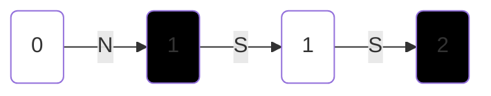
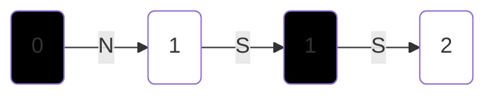

# Movimentos de um rei
Atividade de análise de sistemas Probabilísticos

## Descrição da atividade
Em um tabuleiro de xadrez, existe apenas um rei (o jogo acabou, mas o rei ainda resolveu que queria se mover sozinho pelo tabuleiro).
Entediado, este rei resolveu inventar uma regra de movimento.
Se ao andar (ou quando iniciar o movimento) ele alcançar em uma casa branca, ele SEMPRE anda uma casa a mais para a frente (direção N).
Se, ao andar ou iniciar, ele alcançar uma casa preta, ele joga 3 moedas justas.
Dependendo do resultado das moedas, ele anda para uma das direções possíveis (N, S, W, E, NE, NW, SE, SE).
Se ele chegar em uma das bordas, ele circula para o outro lado (como se o tabuleiro fosse um toroide).

Iniciando em qualquer lugar aleatoriamente, qual a probabilidade de que o rei ande uma sequencia N, S, S, N, NE, SW, SW, NW, NW, SE, SE, NE ?

## Resposta

### Entendendo as regras do jogo

- Se o Rei estiver na casa Branca ele sempre vai escolher N
- Se o Rei estiver na casa preta, ele vai sortear aleatoriamente um dos oito possíveis movimentos: 
  - N, S, W, E, NE, NW, SE, SE
- Dizer que o tabuleiro é uma toroide significa que o tabuleiro é infinito.


### Situação 1, quando o Rei começa na casa Branca


Como o rei na casa branca deve ir para o Norte (N), Ir para o Sul (S) não é
um Movimento Válido.

### Situação 2, quando o Rei começa casa Preta


Novamente Observamos que o Rei está na casa branca e escolhe ir para o Sul, um movimento inválido.


### Simulações

Para verificar que realmente a probabilidade é zero, foi implementado o jogo em python


saída da simulação  quando as direções desejada é N, S, S, N, NE, SW, SW, NW, NW, SE, SE, NE
```shell
python simulation_game.py
processing: 100.0% % 
    number of trails: 1000000 # um milhão
    occurrences: 0
    Probability: 0.0
```

saída da simulação  quando as direções desejada é apenas N

```shell
python simulation_game.py
processing: 100.0% % 
    number of trails: 1000000
    occurrences: 561740
    Probability: 0.56174 # aprox 9/16
```

saída da simulação  quando as direções desejada é  N,N

```shell
python simulation_game.py
processing: 100.0% % 
    number of trails: 1000000
    occurrences: 124666
    Probability: 0.124666 # aprox 1/8
```

## Observações
Para executar o teste da formula da imagem de xadrez, irá precisar
instalar as dependências:
```shell
pip install -r requirements.txt
```
Versão do Python utilizada: __3.10.4__